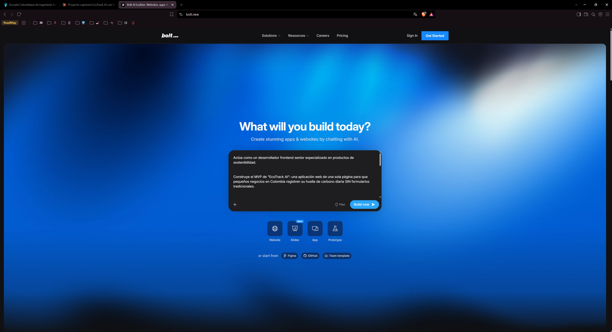
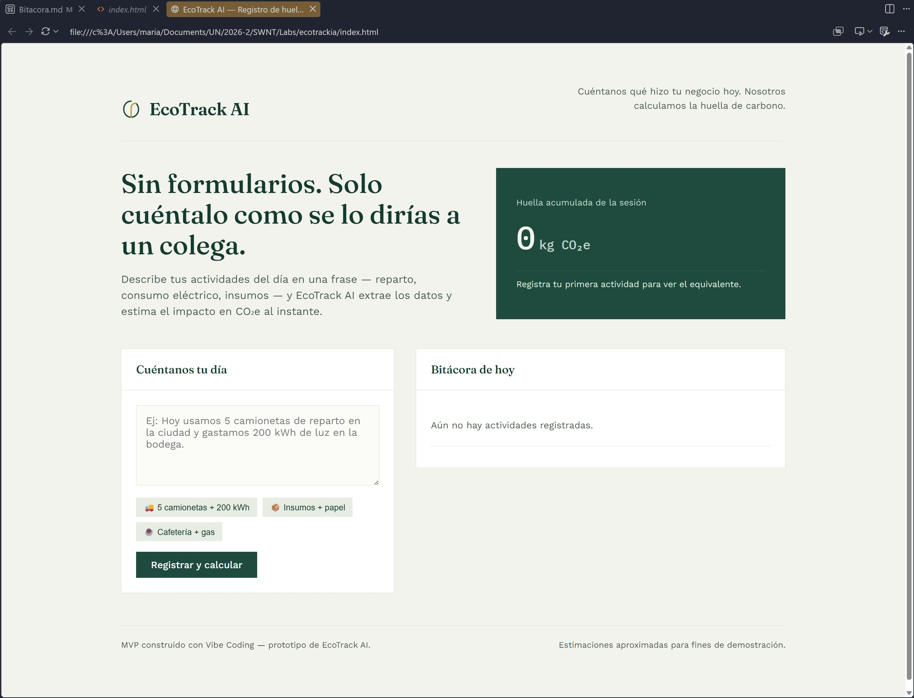
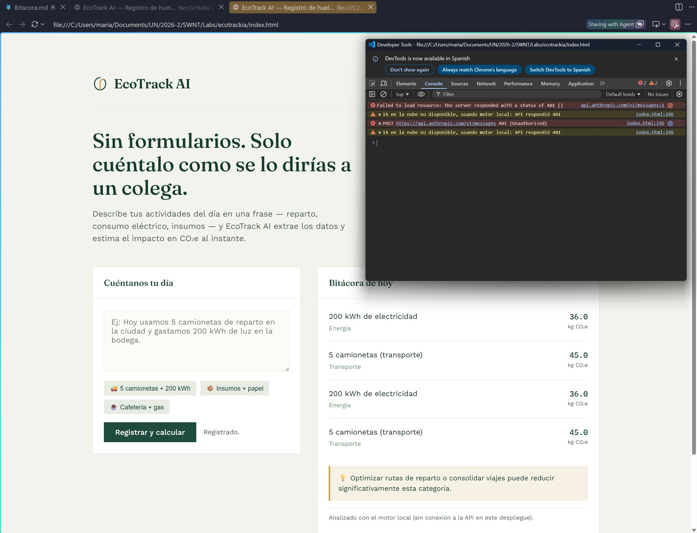
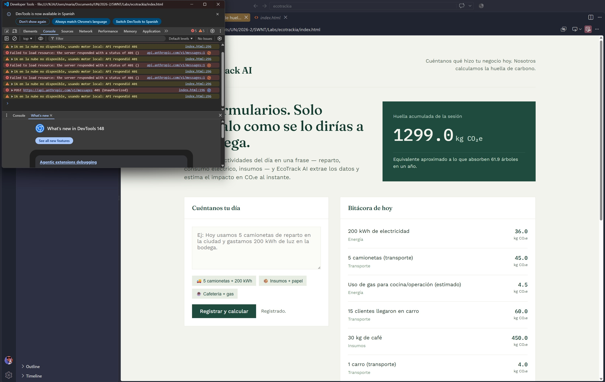

# Bitácora — EcoTrack AI (Proyecto Integrador Capstone: Vibe Coding)

**Autor:** María Belén Quintero.

**Proyecto:** MVP de cálculo de huella de carbono para pequeños negocios

**Herramientas usadas:** Bolt

---

## 1. El "Vibe" del proyecto

**Problema real:** dueños de pequeños negocios en Colombia no tienen tiempo ni conocimiento técnico para llenar formularios de sostenibilidad. Necesitan describir su día como le hablarían a un colega, y recibir un cálculo inmediato.

**Personalidad de la app:** una libreta de contabilidad ambiental, no un dashboard corporativo. Tono cercano, sin jerga técnica, resultados inmediatos y accionables (una recomendación concreta, no solo un número).

**Flujo definido:**
1. El usuario escribe una frase libre describiendo actividades del día.
2. La IA extrae actividades individuales y estima su huella en kg de CO₂e.
3. La interfaz muestra cada actividad en una "bitácora" y acumula un total de sesión.
4. La IA entrega un consejo breve y accionable para reducir la huella.

---

## 2. Master Prompt

Este fue el prompt inicial usado para dirigir a la herramienta de generación de código (Bolt) hacia la visión completa del producto:

```
Actúa como un desarrollador frontend senior especializado en productos de sostenibilidad.

Construye el MVP de "EcoTrack AI": una aplicación web de una sola página para que
pequeños negocios en Colombia registren su huella de carbono diaria SIN formularios
tradicionales.

Flujo funcional:
- El usuario escribe en un textarea una descripción libre de las actividades de su
  negocio hoy (ej: "Hoy usamos 5 camionetas de reparto y gastamos 200kWh de luz").
- Al enviar, el texto se envía a un modelo de lenguaje que debe devolver SOLO un JSON
  con esta forma: {"activities":[{"description","category","co2_kg"}],"total_co2_kg","tip"}
- La interfaz agrega cada actividad detectada a una "bitácora" acumulativa del día y
  suma un total de kg de CO2e visible en todo momento.
- Se muestra una recomendación breve generada por la IA para reducir la huella.

Dirección estética:
- Minimalista, tonos verdes y un acento cálido (dorado/mostaza, NO terracota).
- Tipografía serif editorial para títulos, sans-serif humanista para el resto.
- Nada de tarjetas genéricas con sombra y esquinas redondeadas idénticas; usar paneles
  planos con bordes finos, como una libreta contable.
- El número total de CO2e es el elemento más importante visualmente (tipografía
  monoespaciada, como un instrumento de medición).
- Responsive, accesible, sin animaciones innecesarias — solo un fade sutil al agregar
  una nueva entrada a la bitácora.

Entrega el código completo en un solo archivo HTML autocontenido (HTML + CSS + JS).
```

**Por qué este prompt funciona:** define el problema de negocio (no solo "hazme una app"), el contrato de datos exacto que debe cumplir la IA (el JSON), la dirección estética con restricciones explícitas (para evitar el "look genérico de IA"), y el formato de entrega. Esto reduce drásticamente las rondas de corrección posteriores.

---

## 3. Desarrollo iterativo

| # | Prompt usado | Resultado |
|---|---|---|
| 1 | Master Prompt completo (arriba) | Primera versión funcional: layout de dos paneles, textarea, llamada a la API, renderizado de la bitácora. |
| 2 | *"Haz que el diseño sea más minimalista y use tonos verdes, con un acento dorado en vez de naranja/terracota. El número total debe sentirse como una medición, no como una tarjeta genérica."* | Ajuste de paleta (`#1F4B3F` verde bosque, `#C79A3D` dorado), tipografía monoespaciada solo para las cifras de CO2, eliminación de sombras y bordes redondeados. |
| 3 | *"Agrega ejemplos rápidos (chips) que el usuario pueda pulsar para probar la app sin escribir, y una comparación amigable del total (ej. en árboles) para que el número tenga contexto."* | Se añadieron chips de ejemplo y el cálculo de equivalencia en árboles absorbidos por año. |

**Capturas recreadas del flujo actual:**

**Pantalla inicial: layout y estado vacío**
  

**Ejemplo rápido de funcionamiento**
  
  

---

## 4. Funcionalidad de IA implementada

La funcionalidad central del MVP es **extracción de datos en lenguaje natural + estimación cuantitativa**, usando una llamada real a la API de Claude (`claude-sonnet-4-6`) en cada envío del formulario:

- El texto libre del usuario se envía como mensaje.
- Un system prompt le indica al modelo su rol (motor de análisis de EcoTrack AI), le da rangos de referencia de factores de emisión (ej. ~0.15–0.2 kg CO2e por kWh en la red colombiana, ~8–12 kg CO2e por viaje corto de camioneta de reparto), y le exige responder **únicamente** con un JSON estructurado.
- La respuesta se parsea y se usa para poblar la interfaz dinámicamente: cada actividad detectada, su categoría, su estimación individual, el total acumulado y una recomendación práctica.

Esto resuelve el problema real del enunciado: el negocio no llena un formulario con categorías predefinidas, sino que describe su día como lo haría naturalmente, y la IA hace el trabajo de estructurar y cuantificar.

---

## 5. Resolución de problemas (debugging con IA)

**Desafío encontrado:** en varias pruebas, el modelo devolvía el JSON correcto pero envuelto en explicaciones adicionales o en bloques de código markdown (```json ... ```), lo que rompía el `JSON.parse()` directo y generaba errores silenciosos en la interfaz.

**Cómo se resolvió sin escribir lógica manualmente desde cero:**
1. Se le describió el error exacto a la IA generadora de código: *"A veces la respuesta del modelo viene envuelta en explicación o en \`\`\`json, y el parseo falla. Dame una función robusta que limpie eso y extraiga el primer objeto JSON válido aunque venga rodeado de texto."*
2. La IA propuso una función de extracción de respaldo: primero intenta `JSON.parse` directo tras quitar los backticks de markdown; si falla, busca la primera `{` y la última `}` del texto y reintenta el parseo sobre ese fragmento.
3. Se reforzó también el propio *system prompt* del análisis, siendo aún más explícito en pedir "ÚNICAMENTE JSON, sin texto adicional, sin markdown" — reduciendo la frecuencia del problema en origen, no solo mitigándolo en el frontend.

Esto ilustra el patrón real de debugging en vibe coding: describir el síntoma observado (no la solución) y dejar que la IA proponga el mecanismo, mientras el desarrollador dirige *qué* problema resolver y valida el resultado.

**Problema 1:** al probar el archivo local, la llamada `fetch()` a la API respondió `401` por falta de credenciales. La página no se navegó fuera de EcoTrack: el error quedó registrado en la consola y el `catch` activó el motor local de respaldo.

  

  


**Segundo desafío (encontrado al desplegar):** al subir el archivo a GitHub Pages, la aplicación cargaba pero la funcionalidad de IA fallaba silenciosamente. La causa: la llamada a la API de Claude usada durante el desarrollo funciona sin configuración adicional *dentro* del entorno de artifacts de Claude.ai (la petición va autenticada automáticamente), pero al ejecutarse en un hosting estático externo, el navegador hace esa misma petición sin credenciales y la API la rechaza.

**Solución dirigida por IA, sin backend propio:** en vez de montar un servidor solo para ocultar una API key, se le pidió a la IA generadora de código un motor de respaldo basado en reglas (extracción por expresiones regulares + tabla de factores de emisión) que se activa automáticamente si la llamada a la nube falla. El enunciado permite explícitamente que la funcionalidad de IA sea "simulada o real", así que este *fallback* no es un parche cosmético sino una decisión de arquitectura válida: la versión demostrada en vivo dentro de Claude usa IA real; la versión desplegada de forma independiente usa el motor simulado equivalente, sin que el usuario final note discontinuidad.

---

## 6. Vibe Coding vs. desarrollo tradicional

En un desarrollo tradicional, construir esta interfaz habría implicado: diseñar el layout a mano, escribir el parser de lenguaje natural (o integrar y afinar una librería de NLP), definir manualmente las reglas de categorización y factores de emisión en código, y depurar cada capa por separado — probablemente varios días de trabajo para un MVP funcional.

Con vibe coding, el rol cambió de "escribir cada línea" a **dirigir y validar**: describir la visión completa en un Master Prompt, iterar sobre el resultado con instrucciones en lenguaje natural ("más minimalista", "tonos verdes", "agrega comparación en árboles"), y delegar la corrección de errores técnicos describiendo el síntoma en vez de escribir el fix. El MVP completo — interfaz, lógica de estado, integración real con una API de IA y manejo de errores — se construyó en una sola sesión de iteración, no en varios sprints.

La ganancia principal no fue solo velocidad, sino que permitió mantener el foco en el problema del usuario (un dueño de negocio sin tiempo para formularios) en lugar de en la sintaxis, delegando la implementación mientras el criterio de diseño y producto seguía siendo humano.

---

## 7. Enlace Proyecto Vivo

En el siguiente enlace, se encuentra el proyecto:
- https://mbquial.github.io/ada-EcoTrackIA/
